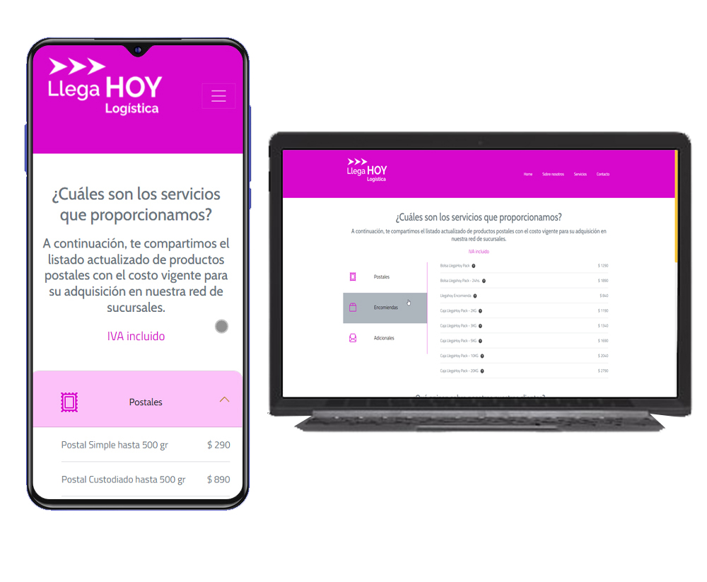

# Llega Hoy - Coderhouse
He creado esta web para un desafio de uso de Bootstrap para el curso de Diseño web de Coderhouse, he continuado mi trabajo en ella para el curso de JS de Coderhouse, y finalmente he seguido mejorando varios aspectos para un proyecto integrador. La web es de una logística ficticia que ofrece sus servicios de correo a potenciales clientes.

## Índice

- [Overview](#overview)
  - [Screenshot](#screenshot)
  - [Links](#links)
- [Mi proceso](#mi-proceso)
  - [Construido con](#construido-con)
- [Autor](#autor)

## Overview

### Screenshot

### Links

- [URL del Sitio Web](https://sgrinblat.github.io/llega-hoy/)

## Mi proceso

### Construido con

- JavaScript
- CSS
- Bootstrap

## Autor

- Linkedin - [Santiago Grinblat](https://www.linkedin.com/in/santiago-grinblat/)

 
